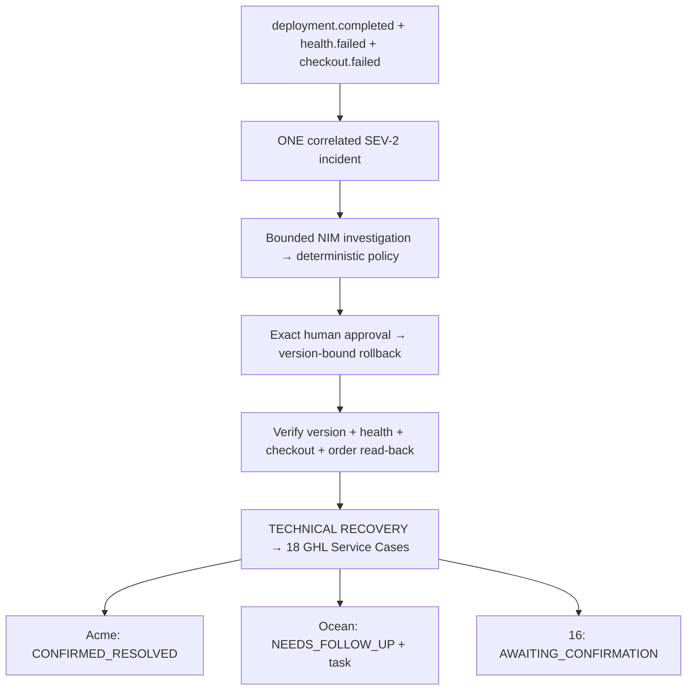
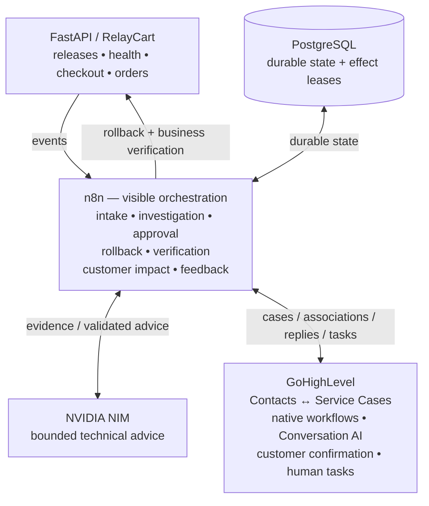
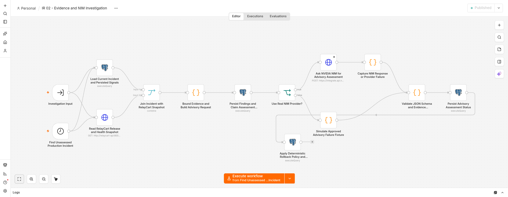
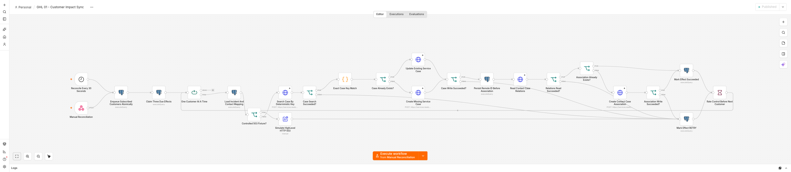
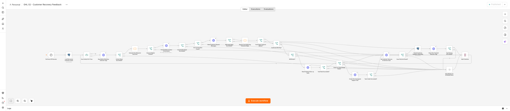
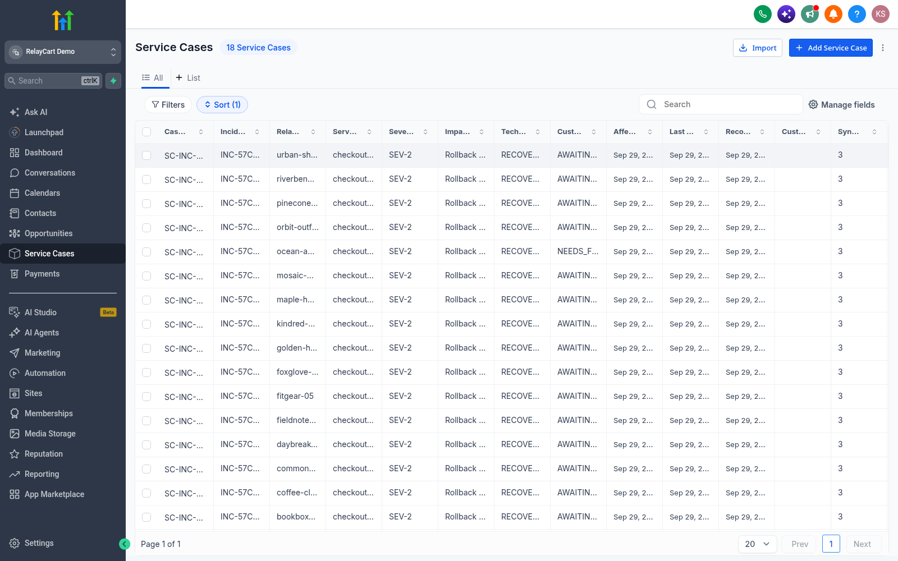
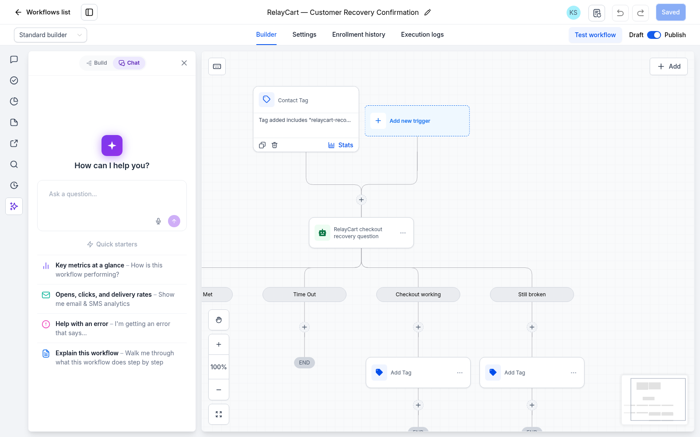

# RelayCart — SaaS Incident Response & Customer Operations Automation

A deployment can complete while the product is broken. RelayCart carries that failure through investigation, human-approved rollback, business recovery checks, and customer confirmation.

[](https://github.com/kabbersokhi-boop/saas-incident-response-customer-operations/actions/workflows/ci.yml)


Six n8n workflows coordinate a deterministic FastAPI SaaS, PostgreSQL, NVIDIA NIM, and a live GoHighLevel demo location. The incident above has recovered, but Ocean Apparel still needs human support. All customer data and failures are synthetic; no real customer messaging, payments, or production deployments are connected.

[Inspect the workflows](n8n/workflows) · [Read the proof record](docs/phase-4-verification.md) · [Run the five-minute demo](docs/demo-script.md) · [Evidence provenance](docs/evidence/portfolio/README.md)

## Why this exists

A successful deploy response does not prove the application is healthy. A green health endpoint does not prove checkout works. A successful rollback response does not prove the business recovered. And technical recovery does not prove every customer is resolved.

RelayCart tests each boundary separately: correlate independent signals, bind an approved action to exact releases, verify an actual checkout and order read-back, then track customer outcomes independently.

## Technical Recovery ≠ Customer Resolution

The [dashboard above](docs/evidence/portfolio/relaycart-final-recovery.png) shows the final incident, `INC-F25410A828C8`, and its customer outcomes:

| Scope | Technical state | Customer state | Human tasks |
| --- | --- | --- | --- |
| Checkout incident | `RECOVERED` | 18 affected customers | — |
| Acme Bikes | `RECOVERED` | `CONFIRMED_RESOLVED` | 0 |
| Ocean Apparel | `RECOVERED` | `NEEDS_FOLLOW_UP` | 1 |
| Other affected customers | `RECOVERED` | 16 `AWAITING_CONFIRMATION` | 0 |
| Green Dental, control | Not affected | No checkout Service Case | — |

Customer confirmation is a separate state transition. A negative reply creates human follow-up without automatically reopening or rolling back the technical incident; silence cannot falsely close a case.

## The signature incident

Healthy `v1.8.1` → deploy `v1.8.2` → one SEV-2 incident → exact approval → rollback `v1.8.2 → v1.8.1` → verified recovery → 18 customer cases.



## Architecture and ownership



| Platform | Responsibility |
| --- | --- |
| n8n | Reviewable orchestration, policy branches, direct provider calls, and customer fanout |
| PostgreSQL | Unique events, correlation, approvals, state transitions, effect claims, and durable retries |
| NVIDIA NIM | Bounded technical advice with validated schema and evidence references |
| GoHighLevel | Customer operations system of record: cases, contact associations, confirmation, follow-up |
| FastAPI | Reproducible releases, failure signals, rollback, checkout, orders, and dashboard |

## Technical response and the AI boundary

Independent events survive deduplication and correlate to one incident. Severity is deterministic. Investigation joins persisted signals with a current application snapshot and bounds the evidence before requesting NIM advice.



*IR 02 — Evidence and NIM Investigation. [Open the real editor capture at full resolution](docs/evidence/portfolio/n8n-technical-response.png).*

NVIDIA NIM investigates. It does not decide severity, authorize rollback, or execute production actions. `openai/gpt-oss-20b` returns advice; n8n validates JSON shape, enums, permitted read checks, and cited evidence IDs. Hostile log text remains evidence, never an instruction granting authority.

An operator approves the exact source/target release pair. Approval expires after 15 minutes, is single-use, and becomes stale when a newer release appears. n8n rechecks the current release before rollback; the API enforces the version binding again. `RECOVERED` requires all four business checks to pass. A rollback with broken checkout becomes `NEEDS_ATTENTION`.

| Workflow export | Inspect for |
| --- | --- |
| [IR 01 — Event Intake and Correlation](n8n/workflows/01-event-intake.json) | Validation, dedupe, correlation, severity |
| [IR 02 — Evidence and NIM Investigation](n8n/workflows/02-evidence-and-nim-investigation.json) | Bounded evidence, provider failure, advice validation |
| [IR 04 — Human Approval and Remediation](n8n/workflows/04-approval-remediation.json) | Exact approval, expiry, replay and stale-action protection |
| [IR 05 — Recovery Verification](n8n/workflows/05-recovery-verification.json) | Release, health, checkout creation, order read-back |

## n8n + GoHighLevel customer orchestration

### GHL 01 — Customer Impact Sync

PostgreSQL enqueues subscribed customers and leases due effects. n8n processes each customer, searches GHL by a deterministic case key, creates or updates the Service Case, persists its remote ID, checks the Contact association, and records success or durable retry. A lost local ID is repaired by rediscovering the same remote case.



*[Full-resolution editor capture](docs/evidence/portfolio/n8n-ghl-impact-sync.png) · [24-node workflow export](n8n/workflows/06-ghl-customer-impact-sync.json)*

### GHL 02 — Customer Recovery Feedback

n8n reads outcome markers, finds the conversation, and validates a fresh inbound reply against the recovery time. Positive and negative branches update the case; negative feedback checks for an existing task before creating one. PostgreSQL persists the outcome, and only transient result tags are cleared. Unavailable reads preserve retryable state.



*[Full-resolution editor capture](docs/evidence/portfolio/n8n-ghl-feedback.png) · [28-node workflow export](n8n/workflows/07-ghl-customer-feedback.json)*

These workflows make the cross-platform calls directly. PostgreSQL supplies durable correctness; Python supplies the SaaS environment and audit helpers. The full graphs remain inspectable in the exports, including failure paths.

### Native customer operations

RelayCart Demo contains 30 mapped synthetic contacts and a real Service Case Custom Object with 14 fields and Contact associations. Checkout subscriptions select 18 customers; Green Dental is a non-subscriber control. Native HighLevel workflows hand recovery to the published **RelayCart — Customer Recovery Confirmation** Conversation AI workflow.



*Historical Phase 3 UI, incident `INC-57C615E767C3`. The current 18 cases and 16/1/1 split are independently API-verified; this image is not a current incident capture.*



*Historical real workflow capture. The current HighLevel browser view failed to render during the launch pass, so this retained evidence is explicitly dated by provenance. It shows the native workflow and AI panel, not the original generation transcript. [Capture details and privacy notes](docs/evidence/portfolio/README.md).*

## Safety and failure proof

| Scenario | Observed behavior |
| --- | --- |
| Same event delivered 20× | One durable event, link, and incident effect |
| NIM timeout or HTTP failure | Assessment unavailable; no approval bypass |
| Invalid AI JSON or unknown `E99` reference | Advice rejected |
| Hostile instruction in a log | Evidence only; no unapproved action |
| Rejected, expired, or replayed approval | No rollback |
| New release after approval | Stale rollback blocked; newer release preserved |
| Rollback succeeds but checkout fails | `NEEDS_ATTENTION` |
| GHL 503 | Durable `RETRY`, then scheduled success |
| GHL case exists but local ID is lost | Same case rediscovered; no duplicate in the test |
| Customer says still broken | One human task; no automatic technical rollback |
| Silence, ambiguity, or contradictory reply | No false resolution |
| Deleted test contacts leave orphan tasks | Location-wide audit catches residue beyond contact-scoped reads |

[Phase 4 verification](docs/phase-4-verification.md) records observed tests, reproduction commands, and limits. [Launch audit](docs/evidence/portfolio/launch-audit.md) records the exact orphan cleanup. Public CI tests deterministic boundaries; it does not verify private live integrations or establish AI accuracy.

## 5-Minute Demo

1. Show healthy `v1.8.1` and perform a normal checkout.
2. Deploy `v1.8.2`; observe deployment completion alongside health and checkout failures.
3. Inspect one correlated SEV-2 incident and the bounded NIM assessment.
4. Approve the exact rollback and inspect version, health, checkout, and order read-back checks.
5. Show 18 recovered GHL Service Cases and the unaffected Green Dental control.
6. Demonstrate Acme confirmation and Ocean follow-up while the incident remains recovered.

The [demo script](docs/demo-script.md) includes exact actions and timing. Running it changes demo state; the published captures preserve the completed incident.

## Quick start

For the basic local SaaS demo, install Docker Engine and Compose:

```bash
cp .env.example .env
docker compose up --build -d
```

Open <http://127.0.0.1:8001>. The seeded SaaS runs standalone. PostgreSQL has no published host port.

The full live integration demo also requires an existing private n8n instance, NVIDIA NIM credentials, and a configured GoHighLevel location. Follow the [runbook](docs/runbook.md), connect the shared network with `./scripts/connect-n8n`, import the workflows, and rebind credentials and instance-specific IDs. Exports are inactive on import and contain credential references, never credential values.

## Verification

Public checks require Python 3 and Node.js, with no Docker or private credentials:

```bash
./scripts/phase4-proof public
```

Live verification requires the private/local integration setup:

```bash
./scripts/phase4-proof technical
./scripts/phase4-proof ghl
```

Technical mode snapshots and restores local demo state and workflow activation flags. GHL mode runs controlled current-case integration tests. Both require the [documented prerequisites](docs/phase-4-verification.md). Original `verify`/`verify-phase2` runners reset incident state; use the preserving wrapper for a prepared demo.

## Where to inspect next

Recommended review: **workflow exports → Phase 4 verification → demo script → design decisions**.

| Path | What to inspect |
| --- | --- |
| [app/](app) | Deterministic SaaS, version safety, incident/customer dashboard |
| [n8n/workflows/](n8n/workflows) | Six visible orchestration graphs; start here for automation engineering |
| [n8n/evaluation/](n8n/evaluation) | Bounded AI fixtures and schema/evidence validation |
| [tests/](tests) | Product contracts, live workflow tests, adversarial assertions |
| [scripts/](scripts) | Reproduction, verification, scoped cleanup, real screenshot capture |
| [docs/](docs) | Runbook, demo, design rationale, interview questions |
| [docs/evidence/](docs/evidence) | Current and historical visual evidence with provenance |

[Design decisions](docs/design-decisions.md) and the [interview guide](docs/interview-guide.md) explain why n8n owns orchestration, why PostgreSQL backs it, why AI cannot execute rollback, why `/health` is insufficient, why approval is release-bound, and why technical and customer statuses stay separate.

## Limitations

This is a single-machine synthetic portfolio demonstration, not a production incident platform. It uses local n8n and a local unauthenticated approval UI, with no production IAM or real outbound customer channels. GHL feedback reaches localhost through polling. NIM can fail; the customer reply matcher is conservative and English-focused.

Cross-platform writes are not a distributed transaction. Controlled retry, identity-repair, and replay tests demonstrate specific failure paths, not every crash or provider-consistency scenario. Seven unmapped contacts also exist in the GHL location; their data is outside this project and excluded from portfolio evidence.

[Engineering release v1.0.0](https://github.com/kabbersokhi-boop/saas-incident-response-customer-operations/releases/tag/v1.0.0) · [Runbook](docs/runbook.md) · [Historical acceptance: Phase 1](docs/phase-1-verification.md), [Phase 2](docs/phase-2-verification.md), [Phase 3](docs/phase-3-verification.md)
