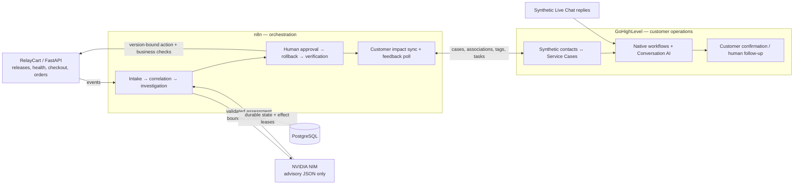
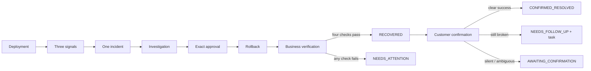
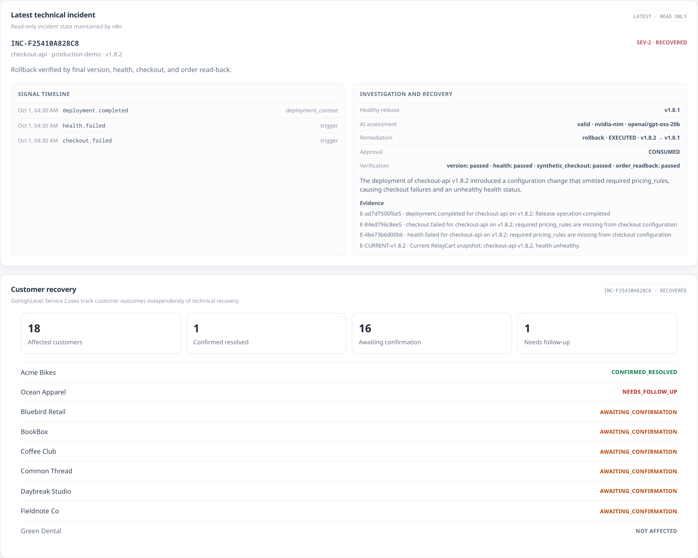
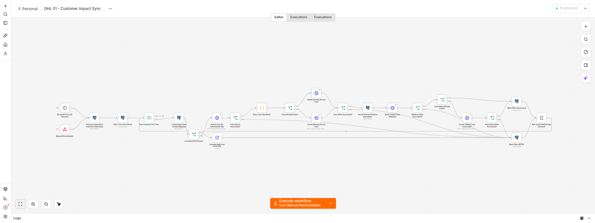

# RelayCart — Incident Response & Customer Operations Automation

RelayCart demonstrates a SaaS incident lifecycle across **n8n, PostgreSQL, NVIDIA NIM, FastAPI, and GoHighLevel**. A completed deployment can leave checkout broken. n8n correlates failure signals, gathers bounded evidence, requests AI advice, and gates an exact rollback on human approval. Recovery requires a working checkout and a retrievable order.

After technical recovery, GoHighLevel tracks affected customers through Service Cases and Conversation AI confirmation. One customer can confirm success while another still needs human support.

**Deployment completion ≠ technical recovery ≠ customer resolution.**

This is a synthetic, single-machine demonstration with real integrations. No real merchant, payment, production deployment, or outbound customer messaging is connected.

## What it demonstrates

- Durable deduplication and many-signal incident correlation.
- Deterministic severity and validated advisory AI.
- Expiring, single-use approval bound to exact releases.
- Business verification and safe provider-failure behavior.
- n8n customer fanout, effect leases, retries, and remote identity repair.
- Separate customer status, conservative confirmation, and human follow-up.

Start with the [proof record](docs/phase-4-verification.md), [workflow exports](n8n/workflows), and [five-minute demo](docs/demo-script.md).

## Architecture



## Signature incident walkthrough

`v1.8.1` is healthy. Deploying `v1.8.2` completes successfully, but health and checkout fail independently. Three persisted signals correlate to one SEV-2 incident. An operator approves `v1.8.2 → v1.8.1`. n8n verifies release, health, checkout creation, and order read-back before recording `RECOVERED`.



## n8n technical incident automation

| Export | Responsibility |
| --- | --- |
| [IR 01](n8n/workflows/01-event-intake.json) | Validation, uniqueness, correlation, deterministic severity |
| [IR 02](n8n/workflows/02-evidence-and-nim-investigation.json) | Evidence, NIM request, validation, policy proposal |
| [IR 04](n8n/workflows/04-approval-remediation.json) | Approval, expiry, replay protection, version-bound rollback |
| [IR 05](n8n/workflows/05-recovery-verification.json) | Release, health, checkout, order read-back |
| [GHL 01](n8n/workflows/06-ghl-customer-impact-sync.json) | Fanout, claim/lease, lookup/create/update, association, retry |
| [GHL 02](n8n/workflows/07-ghl-customer-feedback.json) | Fresh reply validation, outcome, task checks, tag cleanup |

Exports are safe to import: `active` is false or omitted. The demonstrated local instance runs all six workflows active. Exports contain credential ID/name references only. Rebind credentials and instance-specific workflow/GHL IDs before activation; see the [runbook](docs/runbook.md).

## NVIDIA NIM investigation

`openai/gpt-oss-20b` receives bounded evidence with explicit references. n8n validates JSON shape, enums, permitted read checks, and cited IDs. The model has no tools or remediation authority. Deterministic policy decides severity and rollback eligibility.

Provider failure is a tested path, not a reason to bypass approval. [Verification](docs/phase-4-verification.md) distinguishes current observations from historical evaluation. These fixtures do not establish model accuracy.

## Human approval and stale-action safety

The local [approval page](http://127.0.0.1:5678/webhook/phase2/approval/pending) displays the exact action and a 15-minute expiry. Approval is single-use. Deploy `v1.8.3` while an older `v1.8.2 → v1.8.1` proposal is pending: HTTP 409 blocks the old action and preserves the newer release. The API also checks the binding when mutating state.

The approval surface is local and unauthenticated; it demonstrates action safety, not production identity controls.

## GoHighLevel customer operations

**RelayCart Demo** has 30 synthetic contacts, one Service Case object with 14 fields, and a real Contact ↔ Service Case association. Checkout subscriptions select 18 customers; Green Dental is unaffected. Native intake/recovery workflows hand off to the published **Customer Recovery Confirmation** Conversation AI workflow.

Acme becomes `CONFIRMED_RESOLVED`. Ocean becomes `NEEDS_FOLLOW_UP` with one human task while the incident stays `RECOVERED`. Silence and ambiguity stay pending. A result tag alone is insufficient: the latest relevant inbound reply must be newer than recovery and support that outcome. Polling connects GHL to localhost.

## Failure / adversarial proof

| Boundary | Proof |
| --- | --- |
| Duplicate storm | 20 concurrent deliveries → one event, one link, one incident |
| Correlation | Deployment, health, checkout remain distinct in one incident |
| AI / injection | Timeout, HTTP failure, invalid JSON/enum, E99, hostile logs → no unapproved action |
| Approval | Reject, expiry, reuse, changed source release block rollback |
| Recovery | Successful rollback + health green + checkout broken → NEEDS_ATTENTION |
| GHL | 503 → durable RETRY → scheduled success; missing ID repaired by case key |
| Customer uncertainty | Silence, ambiguity, stale markers, contradictory replies cannot falsely close |
| Isolation | Technical regression preserves remote cases and restores workflow states |

See the [observed matrix and reproduction commands](docs/phase-4-verification.md). Live proofs require private credentials; public CI does not.

## Demo screenshots





The [curated evidence index](docs/evidence/README.md) labels real application/editor/GHL captures, rendered graphs, and historical evidence.

## Run locally

Requirements: Docker Engine and Compose; Node.js/Python for public checks; an existing n8n instance for automation.

```sh
cp .env.example .env
docker compose up --build -d
./scripts/connect-n8n
```

Open <http://127.0.0.1:8001>; n8n is at <http://localhost:5678>. Inside `relaycart-n8n`, use `http://relaycart-api:8000` and `relaycart-postgres:5432`. PostgreSQL has no published host port. RelayCart works standalone; the complete demo requires the [credential and import setup](docs/runbook.md).

## Verification

```sh
./scripts/phase4-proof public      # no Docker or credentials
./scripts/phase4-proof technical   # live regression; snapshots/restores local DB
./scripts/phase4-proof ghl         # controlled current-case integration tests
```

Original runners `./scripts/verify` and `./scripts/verify-phase2` reset local incident state. Use the Phase 4 technical wrapper to preserve a prepared demo. GHL mode requires the final 18-case state and existing timeout/ambiguous test conversations.

[Public CI](.github/workflows/ci.yml) checks syntax, workflow structure, secret patterns/history, actual feedback-node safety, AI validators, and a zero-request fixture dry run. It does not verify live integrations.

## Repository structure

| Path | Inspect for |
| --- | --- |
| `app/` | Synthetic SaaS, release safety, incident/customer dashboard |
| `n8n/workflows/` | Six orchestration graphs; start here for n8n engineering |
| `n8n/*.sql` | Durable incident and effect constraints |
| `n8n/evaluation/` | Bounded NIM fixtures and validation |
| `scripts/`, `tests/` | Reproduction, regression, proof, scoped cleanup |
| `docs/`, `docs/evidence/` | Runbook, rationale, interview narrative, visual proof |

## Design decisions

n8n exposes orchestration, policy, branches, and external calls as reviewable workflows. PostgreSQL enforces correctness across retries and concurrent deliveries. FastAPI supplies a deterministic world. GHL owns customer operations. [Design decisions](docs/design-decisions.md) explain the tradeoffs.

## Known limitations

Single-machine synthetic demo; local n8n and unauthenticated approval UI; no production IAM, real observability, payments, deployment platform, or real customer messaging. GHL uses polling. NIM can fail and requires human judgment. Cross-platform writes are not a distributed transaction: controlled identity-repair/task tests do not prove every crash or provider-consistency scenario. Reply matching is conservative and English-only.

The scope prioritizes demonstrable automation engineering over complete production infrastructure.

## Handover / documentation

[Demo script](docs/demo-script.md) · [Runbook](docs/runbook.md) · [Interview guide](docs/interview-guide.md) · [Design decisions](docs/design-decisions.md) · [Phase 4 verification](docs/phase-4-verification.md)

Historical acceptance: [Phase 1](docs/phase-1-verification.md), [Phase 2](docs/phase-2-verification.md), [Phase 3](docs/phase-3-verification.md).
