# RelayCart — SaaS Incident Response & Customer Operations Automation

Restore a revenue-critical checkout journey—and make sure affected customers do not fall through the engineering–support gap.

[](https://github.com/kabbersokhi-boop/saas-incident-response-customer-operations/actions/workflows/ci.yml)


## The business problem

When a commerce SaaS platform's checkout breaks, merchants cannot complete sales. Engineering may restore the service, but support still needs to know **which customers were affected, whether they can transact again, and who needs help**. Closing the technical incident alone leaves that customer work unresolved.

RelayCart connects incident response to customer operations: safely restore checkout, create affected-customer cases in GoHighLevel, request confirmation, and route unresolved customers to human follow-up. Engineering gets verified recovery evidence; support gets customer-level status and actionable tasks.

**The incident can be recovered while a customer still needs help.** Six n8n workflows connect the reproducible SaaS environment to live GoHighLevel so both states remain visible. This synthetic demo demonstrates that handoff; it does not claim measured revenue recovery or production results.

## Watch the end-to-end demo

[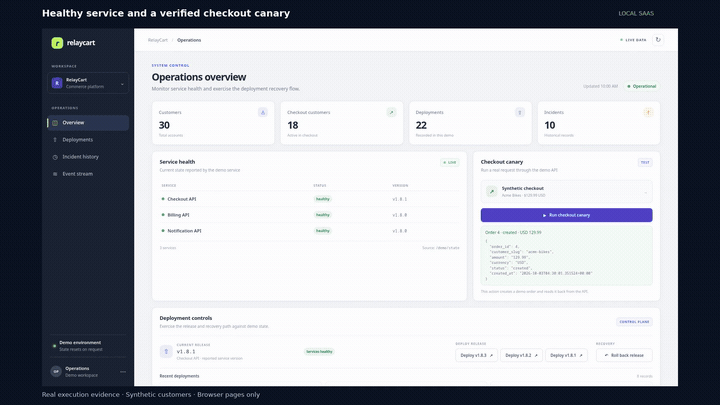](https://github.com/kabbersokhi-boop/saas-incident-response-customer-operations/raw/refs/heads/main/docs/evidence/portfolio/demo/RelayCart-End-to-End-Demo.mp4)

**[Watch / download the full demo — 3:25, 1080p MP4](https://github.com/kabbersokhi-boop/saas-incident-response-customer-operations/raw/refs/heads/main/docs/evidence/portfolio/demo/RelayCart-End-to-End-Demo.mp4)** · The complete journey from checkout failure to verified recovery and customer follow-up.

| Time | What happens | What it demonstrates |
| --- | --- | --- |
| 0:06 | Run a healthy checkout, then deploy the broken release | Deployment completion is not business success |
| 0:29 | Correlate failures and investigate with NIM | One SEV-2; invalid AI output is rejected, not granted authority |
| 0:54 | Review and approve the exact rollback | Single-use, release-bound human approval |
| 1:13 | Inspect successful remediation and all four recovery checks | Version, health, checkout creation and order read-back |
| 1:38 | Sync and inspect 18 live GoHighLevel Service Cases | Live CRM cases, Contact associations and durable fanout |
| 1:54 | Open all three published native GHL workflows | Intake → technical recovery → Conversation AI confirmation |
| 2:33 | Inspect feedback, customer cases and the follow-up task | Acme resolved; Ocean needs help; technical recovery stays intact |
| 3:07 | Review the final customer dashboard | 1 resolved, 1 follow-up, 16 awaiting; control unaffected |

**Demo scope:** local synthetic SaaS and orders; actual n8n executions and live GoHighLevel records. Fresh synthetic replies use the native LiveChat test API—not production outreach. The actual NIM response failed schema validation; the approved rollback and recovery checks still completed successfully. Historical cases and tasks were preserved.

[Screenshot walkthrough](docs/portfolio-demo.md) · [Inspect the workflows](n8n/workflows) · [Safety and retry proof](#safety-and-failure-proof) · [Evidence provenance](docs/evidence/portfolio/README.md)

## Technical Recovery ≠ Customer Resolution

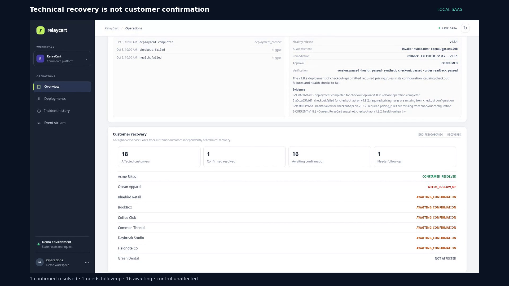

The recorded incident, `INC-7E39998CA856`, finishes with these independently verified outcomes:

| Scope | Technical state | Customer state | Human tasks |
| --- | --- | --- | --- |
| Checkout incident | `RECOVERED` | 18 affected customers | — |
| Acme Bikes | `RECOVERED` | `CONFIRMED_RESOLVED` | 0 |
| Ocean Apparel | `RECOVERED` | `NEEDS_FOLLOW_UP` | 1 |
| Other affected customers | `RECOVERED` | 16 `AWAITING_CONFIRMATION` | 0 |
| Green Dental, control | Not affected | No checkout Service Case | — |

Customer confirmation is a separate state transition. A negative reply creates human follow-up without automatically reopening or rolling back the technical incident; silence cannot falsely close a case.

## The signature incident

Healthy `v1.8.1` → deploy `v1.8.2` → one SEV-2 incident → exact approval → rollback `v1.8.2 → v1.8.1` → verified recovery → 18 customer cases.

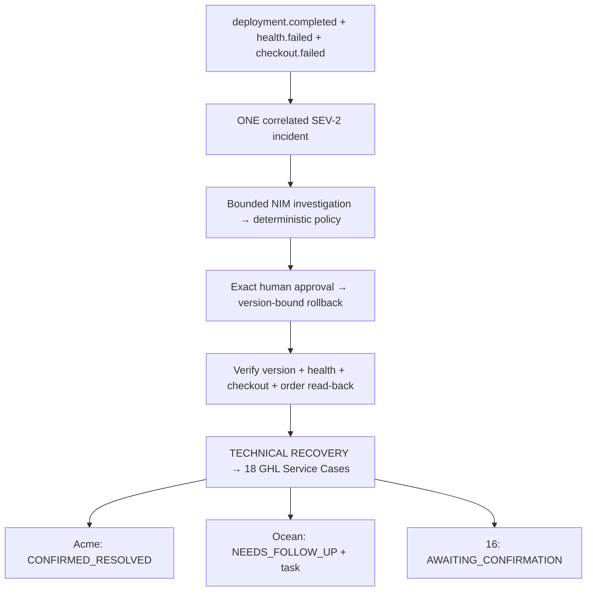

## Architecture and ownership

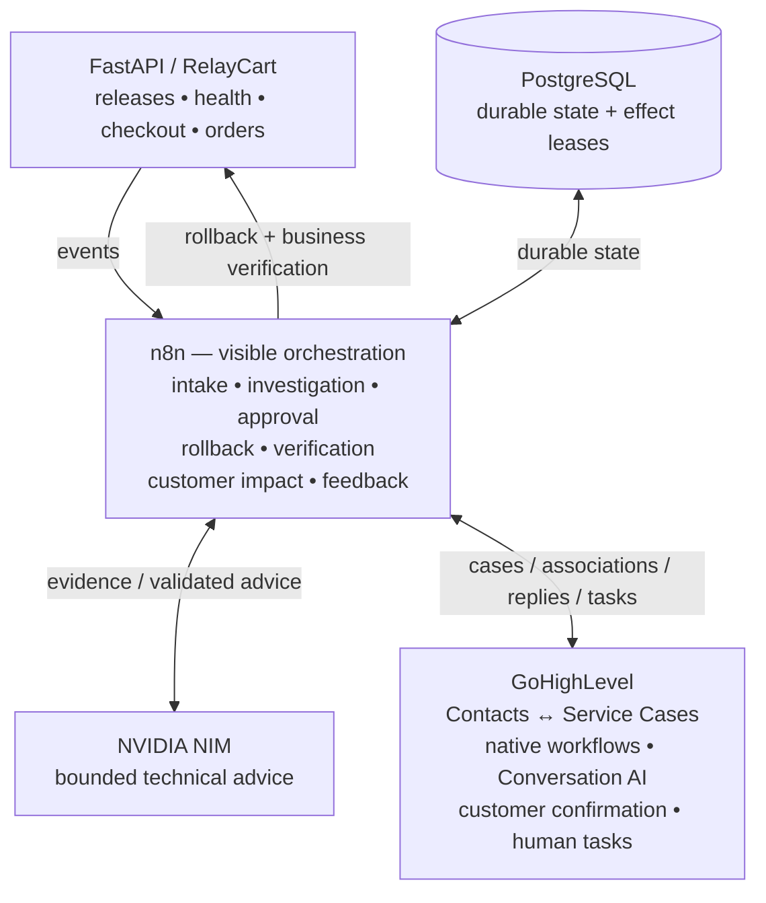

| Platform | Responsibility |
| --- | --- |
| n8n | Reviewable orchestration, policy branches, direct provider calls, and customer fanout |
| PostgreSQL | Unique events, correlation, approvals, state transitions, effect claims, and durable retries |
| NVIDIA NIM | Bounded technical advice with validated schema and evidence references |
| GoHighLevel | Customer operations system of record: cases, contact associations, confirmation, follow-up |
| FastAPI | Reproducible releases, failure signals, rollback, checkout, orders, and dashboard |

## Technical response and the AI boundary

Independent events survive deduplication and correlate to one incident. Severity is deterministic. Investigation joins persisted signals with a current application snapshot and bounds the evidence before requesting NIM advice.

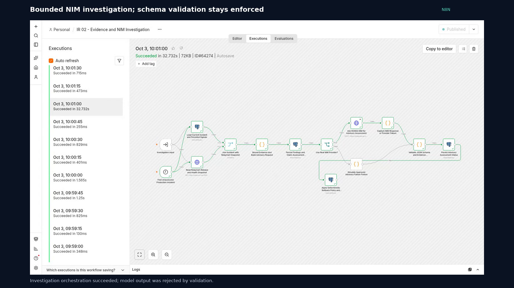

*IR 02 — successful orchestration, not a claim of valid model output. This run rejected the response schema and kept the human approval gate enforced. [Full-resolution execution](docs/evidence/portfolio/demo/03-investigation-success.png).*

NVIDIA NIM investigates. It does not decide severity, authorize rollback, or execute production actions. `openai/gpt-oss-20b` returns advice; n8n validates JSON shape, enums, permitted read checks, and cited evidence IDs. Hostile log text remains evidence, never an instruction granting authority.

An operator approves the exact source/target release pair. Approval expires after 15 minutes, is single-use, and becomes stale when a newer release appears. n8n rechecks the current release before rollback; the API enforces the version binding again. `RECOVERED` requires all four business checks to pass. A rollback with broken checkout becomes `NEEDS_ATTENTION`.

| Workflow export | Inspect for |
| --- | --- |
| [IR 01 — Event Intake and Correlation](n8n/workflows/01-event-intake.json) | Validation, dedupe, correlation, severity |
| [IR 02 — Evidence and NIM Investigation](n8n/workflows/02-evidence-and-nim-investigation.json) | Bounded evidence, provider failure, advice validation |
| [IR 04 — Human Approval and Remediation](n8n/workflows/04-approval-remediation.json) | Exact approval, expiry, replay and stale-action protection |
| [IR 05 — Recovery Verification](n8n/workflows/05-recovery-verification.json) | Release, health, checkout creation, order read-back |

## n8n + GoHighLevel customer orchestration

### GHL 01 — Customer Impact Sync

PostgreSQL enqueues subscribed customers and leases due effects. n8n processes each customer, searches GHL by a deterministic case key, creates or updates the Service Case, persists its remote ID, checks the Contact association, and records success or durable retry. A lost local ID is repaired by rediscovering the same remote case.

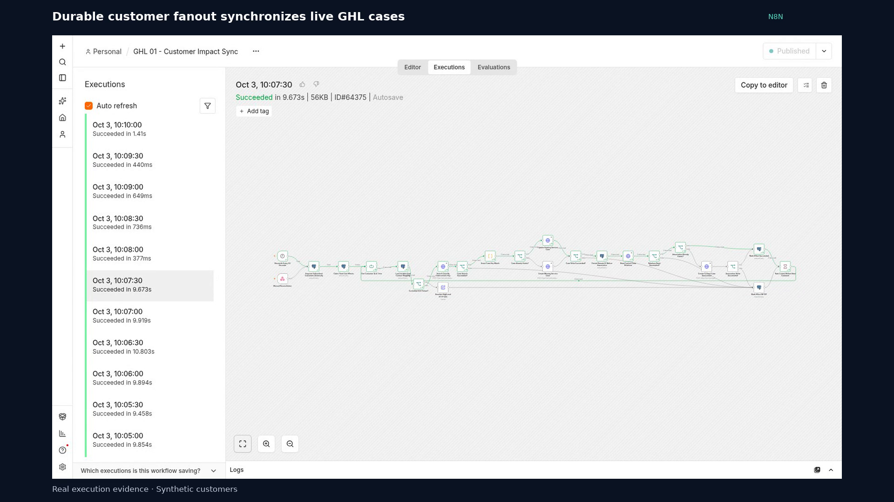

*[Recorded successful execution](docs/evidence/portfolio/demo/06-impact-sync-success.png) · [24-node workflow export](n8n/workflows/06-ghl-customer-impact-sync.json)*

### GHL 02 — Customer Recovery Feedback

n8n reads outcome markers, finds the conversation, and validates a fresh inbound reply against the recovery time. Positive and negative branches update the case; negative feedback checks for an existing task before creating one. PostgreSQL persists the outcome, and only transient result tags are cleared. Unavailable reads preserve retryable state.

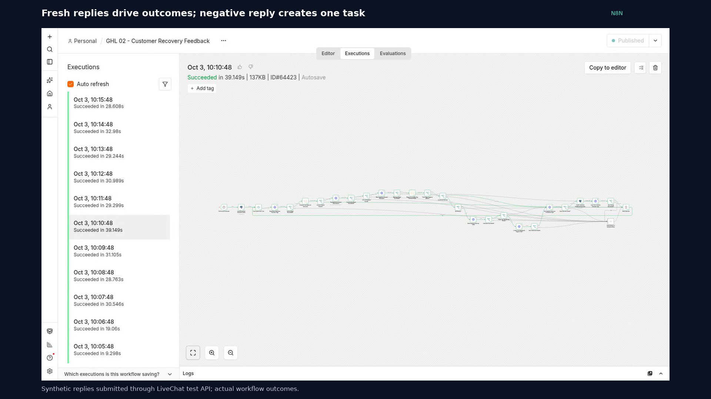

*[Recorded successful execution](docs/evidence/portfolio/demo/12-feedback-success.png) · [28-node workflow export](n8n/workflows/07-ghl-customer-feedback.json)*

These workflows make the cross-platform calls directly. PostgreSQL supplies durable correctness; Python supplies the SaaS environment and audit helpers. The full graphs remain inspectable in the exports, including failure paths.

### GoHighLevel: the customer operations layer

GoHighLevel is more than a destination for incident data. It holds the **Service Case Custom Object**, its Contact associations, native recovery workflows, customer confirmation and human follow-up tasks. RelayCart Demo has 30 mapped synthetic contacts; checkout subscriptions select 18 customers, while Green Dental is a non-subscriber control.

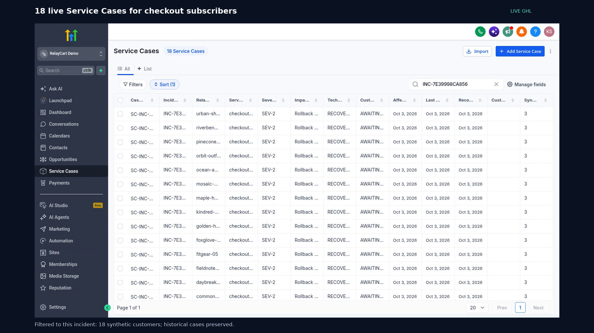

*Live list filtered to the recorded incident. Each case tracks technical status separately from customer status; older incident records remain intact. [Resolved case, follow-up case and task screenshots](docs/portfolio-demo.md#4-customer-confirmation-and-human-follow-up).*

### Three published native GHL workflows

The video opens all three actual workflow builders. These are native GoHighLevel automations—not exported diagrams or replacement n8n canvases.

| Native workflow | Trigger and handoff |
| --- | --- |
| **Service Case Intake** | A Service Case is created → add the intake note |
| **Technical Recovery** | Case technical status becomes `RECOVERED` → update the case and enroll associated records in the next workflow |
| **Customer Recovery Confirmation** | Contact receives the recovery-ready tag → ask whether checkout works; branch on working, still broken, timeout or fallback |

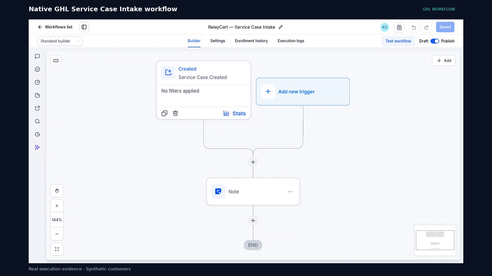

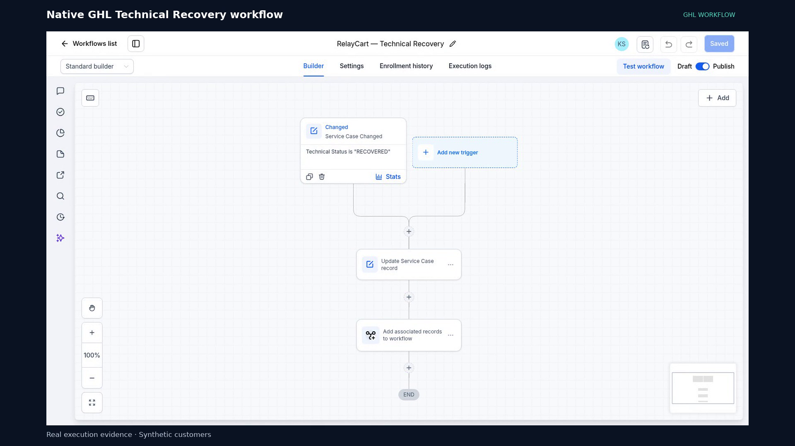

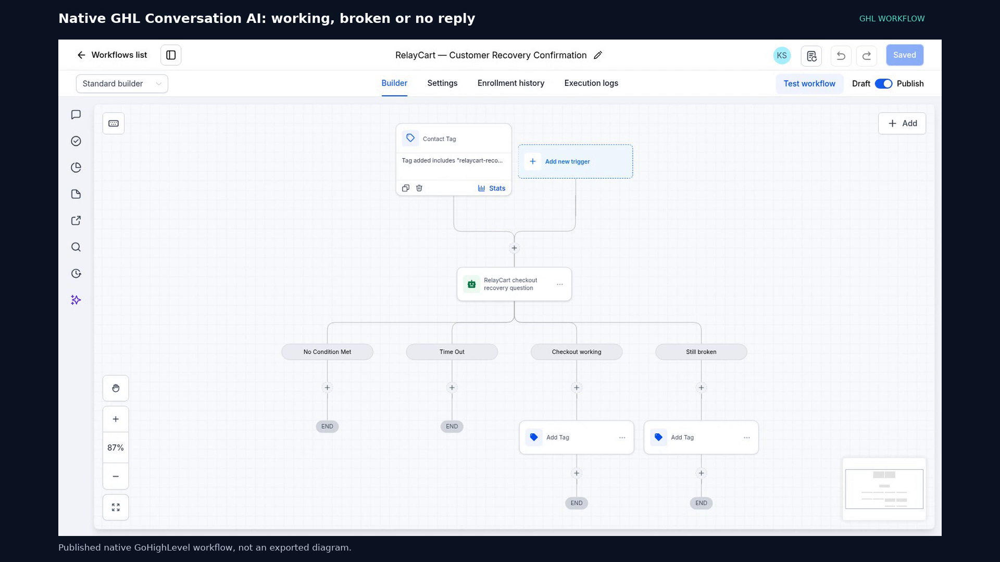

**Clear ownership:** native GHL workflows initiate confirmation; n8n validates fresh inbound replies, reconciles case outcomes and deduplicates support tasks; PostgreSQL persists durable state. Conversation AI cannot authorize rollback or turn silence into confirmed resolution. [View the actual question configuration](docs/portfolio-demo.md#3-native-gohighlevel-recovery-handoff).

## Safety and failure proof

| Scenario | Observed behavior |
| --- | --- |
| Same event delivered 20× | One durable event, link, and incident effect |
| NIM timeout or HTTP failure | Assessment unavailable; no approval bypass |
| Invalid AI JSON or unknown `E99` reference | Advice rejected |
| Hostile instruction in a log | Evidence only; no unapproved action |
| Rejected, expired, or replayed approval | No rollback |
| New release after approval | Stale rollback blocked; newer release preserved |
| Rollback succeeds but checkout fails | `NEEDS_ATTENTION` |
| GHL 503 | Durable `RETRY`, then scheduled success |
| GHL case exists but local ID is lost | Same case rediscovered; no duplicate in the test |
| Customer says still broken | One human task; no automatic technical rollback |
| Silence, ambiguity, or contradictory reply | No false resolution |
| Deleted test contacts leave orphan tasks | Location-wide audit catches residue beyond contact-scoped reads |

[Phase 4 verification](docs/phase-4-verification.md) records observed tests, reproduction commands, and limits. [Launch audit](docs/evidence/portfolio/launch-audit.md) records the exact orphan cleanup. Public CI tests deterministic boundaries; it does not verify private live integrations or establish AI accuracy.

## Reproduce the demo

The [five-minute demo script](docs/demo-script.md) provides exact actions and timing for a new run. The [recorded walkthrough](docs/portfolio-demo.md) explains the published video. Running the live demo changes demo state; viewing the video does not.

## Quick start

For the basic local SaaS demo, install Docker Engine and Compose:

```bash
cp .env.example .env
docker compose up --build -d
```

Open <http://127.0.0.1:8001>. The seeded SaaS runs standalone. PostgreSQL has no published host port.

The full live integration demo also requires an existing private n8n instance, NVIDIA NIM credentials, and a configured GoHighLevel location. Follow the [runbook](docs/runbook.md), connect the shared network with `./scripts/connect-n8n`, import the workflows, and rebind credentials and instance-specific IDs. Exports are inactive on import and contain credential references, never credential values.

## Verification

Public checks require Python 3 and Node.js, with no Docker or private credentials:

```bash
./scripts/phase4-proof public
```

Live verification requires the private/local integration setup:

```bash
./scripts/phase4-proof technical
./scripts/phase4-proof ghl
```

Technical mode snapshots and restores local demo state and workflow activation flags. GHL mode runs controlled current-case integration tests. Both require the [documented prerequisites](docs/phase-4-verification.md). Original `verify`/`verify-phase2` runners reset incident state; use the preserving wrapper for a prepared demo.

## Where to inspect next

Recommended review: **workflow exports → Phase 4 verification → demo script → design decisions**.

| Path | What to inspect |
| --- | --- |
| [app/](app) | Deterministic SaaS, version safety, incident/customer dashboard |
| [n8n/workflows/](n8n/workflows) | Six visible orchestration graphs; start here for automation engineering |
| [n8n/evaluation/](n8n/evaluation) | Bounded AI fixtures and schema/evidence validation |
| [tests/](tests) | Product contracts, live workflow tests, adversarial assertions |
| [scripts/](scripts) | Reproduction, verification, scoped cleanup, real screenshot capture |
| [docs/](docs) | Runbook, demo, design rationale, interview questions |
| [docs/evidence/](docs/evidence) | Current and historical visual evidence with provenance |

[Design decisions](docs/design-decisions.md) and the [interview guide](docs/interview-guide.md) explain why n8n owns orchestration, why PostgreSQL backs it, why AI cannot execute rollback, why `/health` is insufficient, why approval is release-bound, and why technical and customer statuses stay separate.

## Limitations

This is a single-machine synthetic portfolio demonstration, not a production incident platform. It uses local n8n and a local unauthenticated approval UI, with no production IAM or real outbound customer channels. GHL feedback reaches localhost through polling. NIM can fail; the customer reply matcher is conservative and English-focused.

Cross-platform writes are not a distributed transaction. Controlled retry, identity-repair, and replay tests demonstrate specific failure paths, not every crash or provider-consistency scenario. Seven unmapped contacts also exist in the GHL location; their data is outside this project and excluded from portfolio evidence.

[Engineering release v1.0.0](https://github.com/kabbersokhi-boop/saas-incident-response-customer-operations/releases/tag/v1.0.0) · [Runbook](docs/runbook.md) · [Historical acceptance: Phase 1](docs/phase-1-verification.md), [Phase 2](docs/phase-2-verification.md), [Phase 3](docs/phase-3-verification.md)
