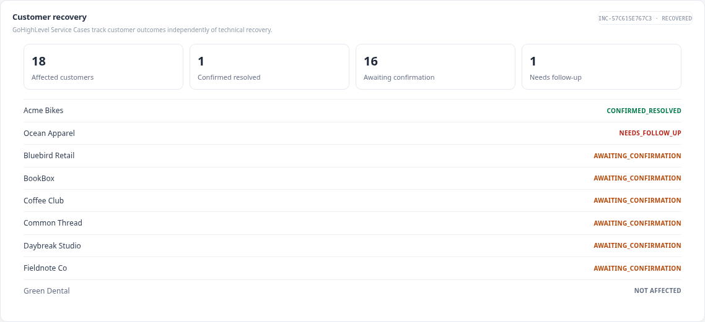

# RelayCart incident response demo

RelayCart is a local, synthetic SaaS operations demo. Phase 1 provides checkout and independent deployment, health, and business-transaction evidence. Phase 2 adds n8n incident automation, PostgreSQL, and advisory NVIDIA NIM investigation. Phase 3 adds customer operations in an isolated GoHighLevel location: 30 synthetic contacts, real Service Case custom objects and associations, three native workflows, Conversation AI recovery confirmation, and human follow-up.

**n8n owns technical recovery; GoHighLevel owns customer recovery.** A technically `RECOVERED` incident does not mean every customer's Service Case is `CONFIRMED_RESOLVED`. One customer can confirm success while another needs support.

The release operation, application health, and business transaction are separate facts:

```text
deployment.completed ≠ health.failed / healthy ≠ checkout.failed / succeeded
```

No real store, customer, payment provider, or production system is connected. Demo data is synthetic.

## Start RelayCart

Requirements: Docker Engine and the Docker Compose plugin.

```sh
cp .env.example .env
docker compose up --build -d
```

The dashboard/API is at <http://127.0.0.1:8001>. The API listens on container port 8000. PostgreSQL is private to Docker networks and has no host-published port. `.env.example` contains local demo-only credentials; do not reuse them.

## Connect the existing n8n instance

Phase 2 uses the existing local n8n instance. To attach it to the project network and verify its in-network access:

```sh
./scripts/connect-n8n
```

The shared Docker network is `relaycart-n8n`; RelayCart is addressed there as `http://relaycart-api:8000` and `relaycart-postgres:5432`. The helper starts only this project's API and database services and does not recreate n8n. See [Phase 2 architecture](docs/phase-2-architecture.md) for schema setup and the workflow status.

## Phase 1 demo

1. Open the dashboard. Run a checkout and confirm its order can be read back.
2. Deploy `v1.8.2`. The deployment operation completes. A subsequent health probe independently reports the application unhealthy, and a checkout independently fails. `/logs` exposes `deployment.completed`, `health.failed`, and `checkout.failed` as distinct events.
3. Roll back from the dashboard and verify health and checkout again.
4. Use **Reset demo state** to restore healthy `v1.8.1`.

## Phase 2 status

Phase 2 runs in the existing local n8n instance. Its four workflows ingest and correlate signals, gather bounded evidence, request NVIDIA NIM advice, gate a version-bound rollback on explicit approval, and verify actual checkout recovery. The live happy path, stale approval, and verification-failure paths have been exercised; see [the evidence and limitations](docs/phase-2-verification.md).

The processing path is RelayCart operational events → n8n validation/correlation/evidence gathering → NVIDIA NIM advisory assessment → explicit human approval → version-bound rollback → health, checkout, and order-readback verification. n8n owns the incident process; model advice does not authorize changes. The local approval page is at <http://127.0.0.1:5678/webhook/phase2/approval/pending>. Follow the [Phase 2 demo](docs/phase-2-demo.md) and [AI investigation contract](docs/ai-investigation.md). Workflow exports require each reviewer to bind their own local Postgres/NIM credentials; no credential values are in this repository.

## Verification

Phase 1 checks:

```sh
./scripts/verify
```

Phase 2 checks (requires the local Compose services and existing n8n instance):

```sh
./scripts/verify-phase2
```

The Phase 2 verification report lists which live workflow scenarios have been exercised and any remaining limitations.

## Phase 3 customer operations

The two small Phase 3 n8n workflows reconcile customer impact and feedback. A deterministic PostgreSQL effect ledger retries temporary HighLevel failures without changing the technical incident. RelayCart subscriptions select the 18 checkout customers; Green Dental is the unaffected control. Each affected customer receives one associated HighLevel Service Case per incident.

The native HighLevel Service Case Intake and Technical Recovery workflows hand a recovered case to the contact-based Customer Recovery Confirmation workflow. Its Conversation AI asks the customer to retry checkout. Confirmation closes only that customer's case; a still-broken reply creates a human follow-up task while the technical incident remains `RECOVERED`. Test chat uses only synthetic Live Chat conversations, never real outbound SMS or email.



See the [Phase 3 architecture](docs/phase-3-architecture.md), [data model](docs/ghl-data-model.md), [reproduction](docs/phase-3-demo.md), and [verification](docs/phase-3-verification.md). The dashboard at <http://127.0.0.1:8001> displays the customer-recovery projection; GoHighLevel remains the customer-operations system of record.

## Boundaries

This is a single-machine synthetic demo, not a production incident-management service. It has no production IAM, real customer records, real customer messaging, payment integration, or deployment target. The local approval page is not authenticated for production use. NVIDIA NIM is an advisory investigator only. Log contents are untrusted evidence. A successful rollback response alone does not constitute recovery.

See [Phase 1 architecture](docs/architecture.md), [business scenario](docs/business-scenario.md), [Phase 1 verification](docs/phase-1-verification.md), and the Phase 2 documents linked above.
