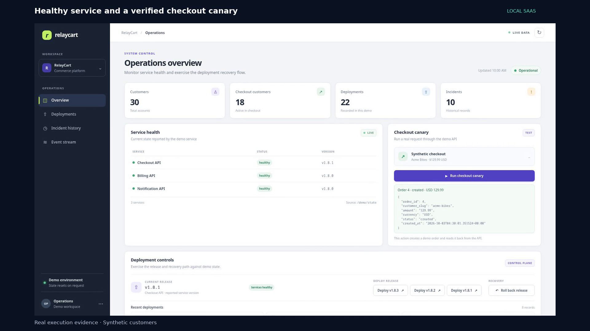
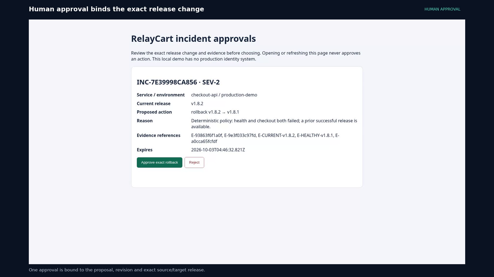
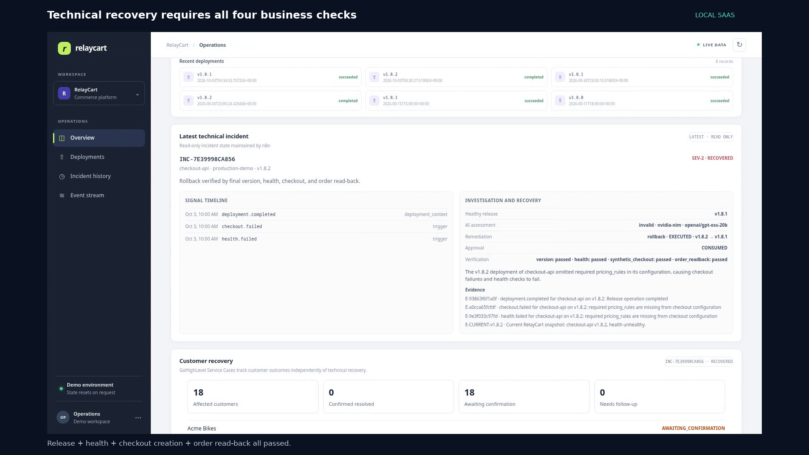
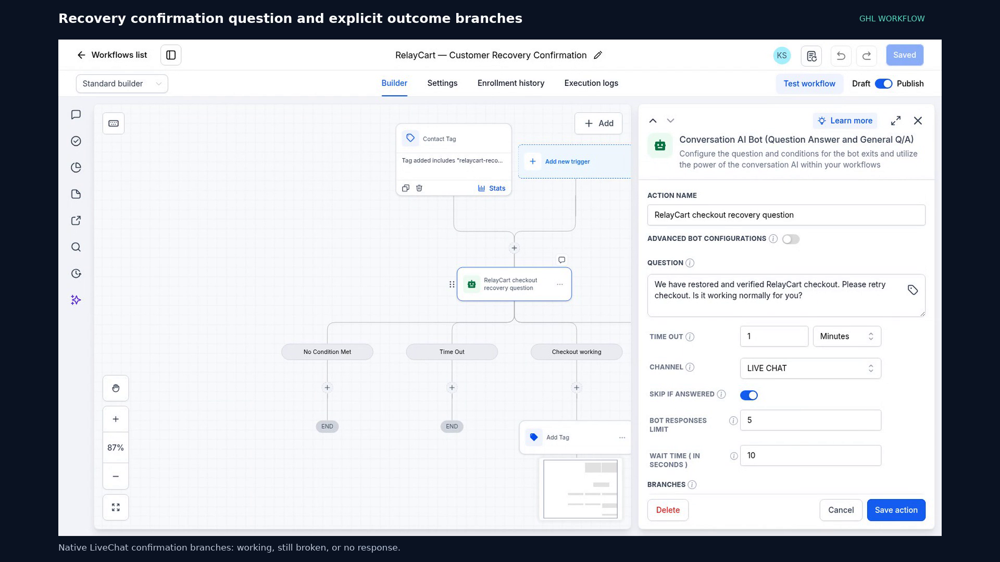
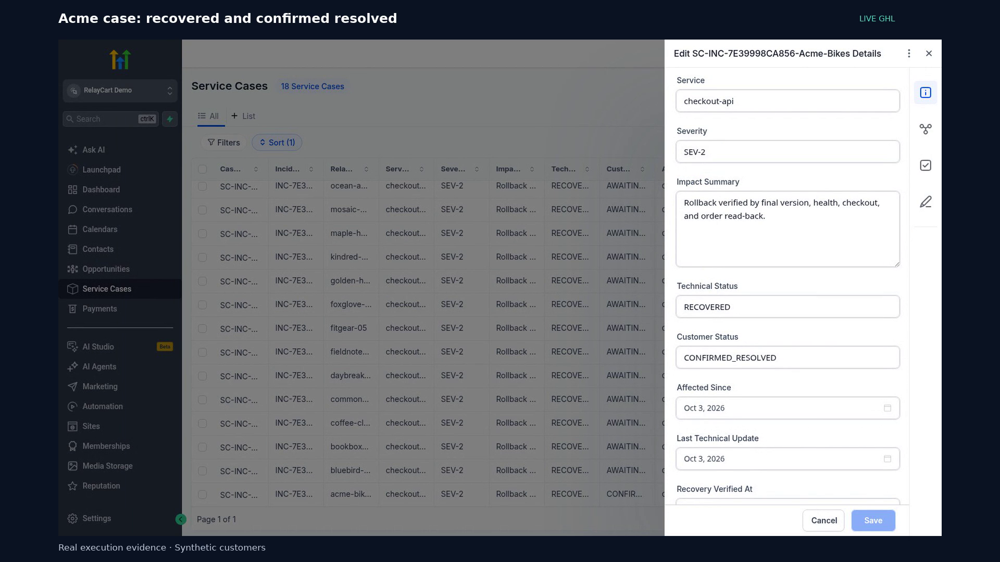
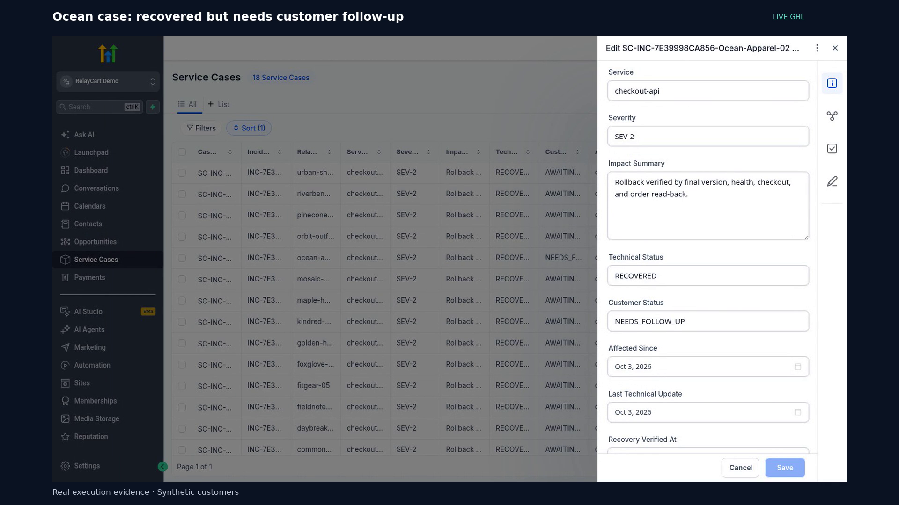
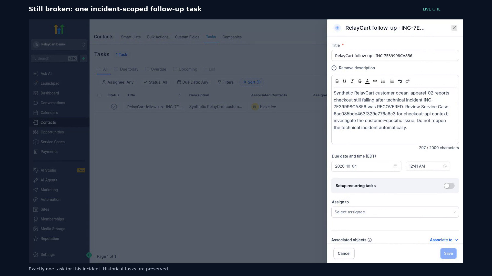

# RelayCart — recorded demo walkthrough

[Watch the complete 3:25 demo](https://github.com/kabbersokhi-boop/saas-incident-response-customer-operations/raw/refs/heads/main/docs/evidence/portfolio/demo/RelayCart-End-to-End-Demo.mp4) · [Back to the project](../README.md) · [Evidence provenance](evidence/portfolio/README.md)

One continuous story: a broken checkout becomes a correlated incident, an operator approves the exact rollback, business checks verify recovery, and live GoHighLevel records distinguish customer confirmation from technical success.

The service, releases, orders and customers are synthetic. n8n executions and GoHighLevel records are real. Synthetic replies were submitted through the native LiveChat test API; no production outreach is claimed. All screenshots below are frames from the reviewed recording, captured on **2026-10-03**.

## 1. Checkout failure and the approval boundary

**0:06–1:13.** A healthy `v1.8.1` checkout creates an order. Deploying `v1.8.2` completes, but checkout and health fail. n8n correlates those signals into `INC-7E39998CA856`, one SEV-2 incident.

The actual NIM response failed top-level schema validation. Successful investigation orchestration means the provider result was processed and rejected—not that the AI answer was valid. Deterministic policy creates a rollback proposal, but an operator must approve its exact source/target release and revision.

The recording shows the actual **Approve exact rollback** click. The approval is consumed once; remediation checks the current release again before acting.

## 2. Verified recovery and live customer fanout

**1:13–1:54.** Successful remediation is followed by four separate checks: final release, service health, checkout creation and order read-back. Only then does the incident become `RECOVERED`.

n8n's customer-impact workflow reconciles 18 live Service Cases and their Contact associations. The case list is filtered to this incident; 18 older cases remain intact. Green Dental is not subscribed to checkout and has no case for this incident.

## 3. Native GoHighLevel recovery handoff

**1:54–2:27.** All three published native workflow builders appear in the video and [directly in the README](../README.md#three-published-native-ghl-workflows):

1. **Service Case Intake:** created-case trigger → intake note.
2. **Technical Recovery:** technical status `RECOVERED` → update the case → enroll associated records.
3. **Customer Recovery Confirmation:** recovery-ready Contact tag → native Conversation AI question → explicit working, still-broken, timeout and fallback branches.

The question asks the customer to retry checkout and confirm whether it works. Native GHL starts that confirmation flow; n8n independently validates a fresh inbound reply before persisting an outcome. AI does not authorize rollback, and silence does not mean resolution.

## 4. Customer confirmation and human follow-up

**2:33–3:18.** Fresh synthetic replies exercise both outcomes. The successful feedback execution validates the replies, updates the cases and checks for an existing task before creating a new one.

The final dashboard shows **1 confirmed resolved, 1 needing follow-up and 16 awaiting confirmation**. Ocean's negative reply creates human work without reopening the technical incident. Historical tasks were preserved; the one-task claim is scoped to this incident.

## Recorded execution evidence

Each execution below was checked for successful status and association with the recorded incident. All six canvases are shown in the video; the workflow exports remain the best way to inspect individual nodes.

| n8n path | Execution ID | Video |
| --- | --- | --- |
| Event intake and correlation | `64267` | 0:29 |
| Evidence and NIM investigation | `64274` | 0:46 |
| Human approval and remediation | `64332` | 1:13 |
| Recovery verification | `64333` | 1:21 |
| Customer impact sync | `64375` | 1:38 |
| Customer recovery feedback | `64423` | 2:33 |

[Scoped outcome verification](evidence/portfolio/demo/verification.json) records the four passing checks, consumed approval, 18 cases, 16/1/1 outcomes, correct Contact associations and one new task. This is recorded-run evidence, not a production guarantee. Retry, replay, stale-approval and provider-failure tests are documented separately in [Phase 4 verification](phase-4-verification.md).

The MP4 is H.264, 1920×1080 at 30 fps, with embedded chapters for navigation.
